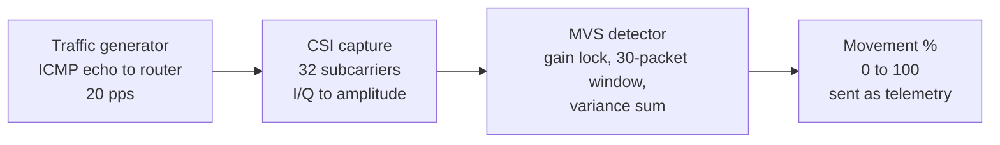

<p align="center">
  
</p>

<h1 align="center">Securi-Fi Hardware & Firmware</h1>

<p align="center">
  <strong>Intuitive by design. Private by nature.</strong>
</p>

---

## Table of Contents

- [About Securi-Fi](#about-securi-fi)
- [Built for DPIT](#built-for-dpit)
- [Key Features](#key-features)
- [System Architecture](#system-architecture)
- [Hardware and Sensor Specifications](#hardware-and-sensor-specifications)
- [Wi-Fi Sensing and CSI Motion Detection](#wi-fi-sensing-and-csi-motion-detection)
- [How Commands Work](#how-commands-work)
- [Telemetry and MQTT Protocol](#telemetry-and-mqtt-protocol)
- [Tech Stack](#tech-stack)
- [Related Repositories](#related-repositories)
- [Repository Structure](#repository-structure)
- [Getting Started](#getting-started)
- [Auxiliary Tools](#auxiliary-tools)
- [Known Limitations](#known-limitations)
- [Team](#team)
- [Documentation and Support](#documentation-and-support)
- [License](#license)

---

## About Securi-Fi

Every home security system available today relies on compromises: it offers the protection you need while sacrificing reliability, privacy, or comfort. We noticed this a couple of months ago, and Securi-Fi is our answer to it.

By repurposing the Wi-Fi already present in your home, Securi-Fi provides the same level of protection without disrupting your daily life. It is an easy-to-install, easy-to-use four-node mesh system that reimagines Wi-Fi traffic as a through-wall motion detector. Simply put, it identifies the intruder without ever needing to see them.

**No cameras. Easy to install. Private by design.**

Beyond intrusions, each node also monitors for smoke and flammable gas with an onboard MQ-2 sensor. When motion or a hazardous gas level is detected, the node sounds a local alarm and the mesh streams real-time telemetry to the cloud for notification and diagnostics.

This repository contains the **embedded firmware** for the ESP32-C6 nodes (one Master and up to three Slaves): the Wi-Fi Channel State Information (CSI) motion-sensing algorithm, the peripheral drivers, and the deployment and diagnostic tools. The mobile app, REST backend, and ingestion server live in separate repositories, linked [below](#related-repositories).

---

## Built for DPIT

Securi-Fi is a six-person team project built over three months for **DPIT** (Discover Your Passion in IT), a Romanian high school technology competition. The work is split across hardware firmware, an ingestion server, and the mobile app, which is why the system spans three repositories that share a single Firebase project.

---

## Key Features

- **Device-free through-wall motion sensing**: uses Wi-Fi Channel State Information (CSI) subcarrier variance to detect human presence without cameras, wearables, or line of sight.
- **Hybrid ESP-NOW and Wi-Fi mesh**: Slave nodes talk to the Master over low-overhead peer-to-peer ESP-NOW, and the Master bridges the whole mesh to the cloud over Wi-Fi and MQTT.
- **Multi-hazard sensing**: an MQ-2 sensor on every node monitors smoke and flammable gas, with a power gate that switches the sensor heater off in standby.
- **Responsive asynchronous design**: network-heavy work (ICMP traffic generation and CSI capture) stays off the main loop, which uses `asyncio` for sensor polling, state machines, and message dispatch.
- **Power and sleep management**: software-commanded deep sleep, an automatic sleep timer, and a physical button that triggers sleep with wake-on-GPIO.
- **Smart battery monitoring**: median-filtered, EMA-smoothed voltage readings mapped through a non-linear LiPo discharge curve.
- **Local acoustic alerts**: a buzzer plays a continuous tone for intrusions and a pulsing tone for gas warnings.
- **Self-healing**: a watchdog restarts unresponsive nodes, and Wi-Fi reconnect and ESP-NOW retry logic recover from network drops.
- **Developer tooling**: a single CLI for flashing and deploying (`me`), a live multi-node telemetry plotter (`grapher`), and MQTT test scripts.

---

## System Architecture

Securi-Fi operates on a four-node layout consisting of one **Master node** and up to three **Slave nodes**. Every node senses environment activity independently through the local home router. Slave nodes report their telemetry to the Master over ESP-NOW, making the Master the sole gateway between the physical hardware and the cloud.

The app and backend never communicate with the hardware directly. **Cloud Firestore serves as the central state hub and handoff point** for the entire system.

### Node Roles

- **Slave Nodes (ESP32-C6)**:
  - Generate ICMP echo traffic to the home router to induce Wi-Fi frames.
  - Capture Channel State Information (CSI) and run the Motion Variance Sum (MVS) algorithm locally.
  - Read environmental metrics from the MQ-2 gas sensor and monitor battery status.
  - Send packet telemetry to the Master node over ESP-NOW every 500 ms.

- **Master Node (ESP32-C6)**:
  - Performs all standard sensing duties of a Slave node (CSI, gas, and battery monitoring).
  - Listens for ESP-NOW telemetry packets from all paired Slave MAC addresses.
  - Aggregates system-wide readings into a single payload and publishes it to the `securifi/master` MQTT topic every 1000 ms.
  - Subscribes to command topics (`securifi/config/command/{master_mac}`), executes incoming commands locally or relays them to Slaves over ESP-NOW, and publishes hardware confirmations back to the server.

### Data Flow & Component Interaction

1. **Hardware Sensing & Local Aggregation**: Slave nodes gather CSI data, run motion algorithms, and stream 500 ms telemetry updates over ESP-NOW to the Master node.
2. **Cloud Ingestion**: The Master node consolidates all node telemetry into a single payload and publishes it every 1000 ms over MQTT to the Ingestion Server, which updates Cloud Firestore using the Firebase Admin SDK.
3. **App Synchronization**: The Securi-Fi Mobile app connects directly to Cloud Firestore via real-time snapshot listeners to reflect node status, active hazards, and system alerts instantly.

---

## Hardware and Sensor Specifications

### Pinout (Master and Slaves)

All nodes share the same pinout:

| Function | GPIO | Mode | Description |
| --- | --- | --- | --- |
| **Battery ADC** | `0` | `ADC1_CH0` (analog in) | Battery voltage through a 2:1 resistive divider |
| **MQ-2 analog read** | `1` | `ADC1_CH1` (analog in) | Raw gas and smoke reading |
| **MQ-2 power switch** | `2` | Digital out | Power gate for the sensor heater (low-power standby) |
| **Push button** | `3` | Digital in (internal pull-up) | Short press: deep sleep. Long press (3 s or more): reboot. Wakes the node on `LOW`. |
| **Buzzer** | `8` | Digital out | Alarm output for intrusion and gas alerts |

### Battery Monitoring

- **Divider ratio**: `2.0`, which scales a 3.0 to 4.2 V LiPo range to 1.5 to 2.1 V at the ADC.
- **Sampling**: 10 ADC samples per reading, take the median, then smooth with an exponential moving average (alpha = 0.3).
- **Percentage curve**: a non-linear, multi-point voltage map, for example 4.20 V = 100%, 3.85 V = 70%, 3.65 V = 30%, and 3.00 V = 0%.

### MQ-2 Gas and Smoke Sensor

- **Warmup**: 30 seconds of heater stabilization after arming.
- **Trigger logic**: a warning requires 3 consecutive readings above the threshold (raw ADC value `1500`), which filters out transient spikes.

---

## Wi-Fi Sensing and CSI Motion Detection

Securi-Fi detects movement by measuring how people alter the radio-frequency multipath environment between a node and the router.



1. **Traffic generation (`traffic_generator.py`)**: a background thread sends ICMP echo requests to the router (the gateway) at a steady rate, 20 packets per second by default. Each packet carries the identifier `0x5346` (`"SF"`), so the frames can be recognized.

2. **CSI capture (`csi_capture.py`)**: enables the Wi-Fi CSI driver (`wlan.csi_enable()`) and filters incoming frames by the router's MAC address. Each 128-byte CSI payload holds 32 subcarriers of 4 bytes each (a signed 2-byte I value and a signed 2-byte Q value), which are converted to linear amplitudes:

   $$A_k = \sqrt{I_k^2 + Q_k^2}$$

3. **Motion Variance Sum detection (`mvs_detector.py`)**:
   - **Gain lock**: at boot, the node collects 100 packets (`GAIN_LOCK_PACKETS`) in an undisturbed room to establish a baseline.
   - **Sliding window**: it keeps the last 30 amplitude samples per subcarrier (`WINDOW_SIZE = 30`).
   - **Variance sum**: when a person moves through the Wi-Fi field, multipath scattering makes the amplitudes fluctuate, and the summed variance spikes above the baseline.
   - **Output**: a normalized movement percentage from 0 to 100, passed to the telemetry layer.

---

## How Commands Work

Commands from the mobile app use a strict **request, then confirm** handshake across the cloud and the mesh.

1. **Command ingestion**: the app writes a requested state change to Cloud Firestore. The ingestion server picks it up and publishes an MQTT command to `securifi/config/command/{master_mac}`:
   ```json
   {
     "cmd": "arm",
     "node_id": "slave_1"
   }
   ```
2. **Master routing**:
   - If `node_id` is `"master"`, the Master runs the command locally.
   - If `node_id` is a Slave (`"slave_1"`, `"slave_2"`, or `"slave_3"`), the Master forwards it over ESP-NOW to that Slave's registered MAC address.
3. **Execution and confirmation**: the target runs the action and returns a confirmation packet:
   ```json
   {
     "type": "confirmed",
     "node_id": "slave_1",
     "cmd": "arm",
     "success": true
   }
   ```
4. **Cloud confirmation**: the Master publishes the result to `securifi/config/confirm/{master_mac}`:
   ```json
   {
     "node_id": "slave_1",
     "master_mac": "58:E6:C5:12:05:E0",
     "cmd": "arm",
     "success": true
   }
   ```
   The ingestion server reads it and updates the node's authoritative state in Firestore. If a command fails or times out, the server reverts the pending request, so the app never shows a state the hardware did not reach.

### Supported Commands

| Command | Action | Scope |
| --- | --- | --- |
| `arm` | Resumes CSI traffic and sensing, powers on the MQ-2 heater | Master or one Slave |
| `disarm` / `standby` | Pauses CSI sensing, cuts MQ-2 power, silences the buzzer | Master or one Slave |
| `buzzer_on_alarm` | Continuous intruder alarm | Master or one Slave |
| `buzzer_on_warning` | Pulsing gas alarm | Master or one Slave |
| `buzzer_off` | Stops any active buzzer pattern | Master or one Slave |
| `deep_sleep` | Enters ultra-low-power deep sleep (wakes when GPIO 3 goes `LOW`) | Master or one Slave |
| `reboot` | Soft reboot with `machine.reset()` | Master or one Slave |

---

## Telemetry and MQTT Protocol

### Telemetry Packet (`securifi/master`)

Published by the Master every 1000 ms:

```json
{
  "master_mac": "58:E6:C5:12:05:E0",
  "timestamp": "1710000000.0",
  "nodes": [
    {
      "node_id": "master",
      "role": "master",
      "movement_pct": 14,
      "sensor_reading": 420,
      "battery_pct": 92,
      "report_type": null,
      "warning_type": null
    },
    {
      "node_id": "slave_1",
      "role": "slave",
      "armed": true,
      "movement_pct": 82,
      "sensor_reading": 510,
      "battery_pct": 87,
      "report_type": null,
      "warning_type": null
    },
    {
      "node_id": "slave_2",
      "role": "slave",
      "armed": false,
      "movement_pct": null,
      "sensor_reading": null,
      "battery_pct": 0,
      "report_type": "not_transmitting",
      "warning_type": null
    }
  ]
}
```

The ingestion server writes these readings to Firestore, where field names are camelCase (for example, `battery_pct` becomes `batteryPct`).

### Diagnostic Report Types (`report_type`)

| Value | Meaning |
| --- | --- |
| `null` | Healthy transmission |
| `"low_battery"` | Battery level below 15% |
| `"not_transmitting"` | No ESP-NOW report within `SLAVE_TIMEOUT_MS` (2000 ms) |
| `"weak_signal"` | Packets dropped by the traffic generator exceeded the threshold |
| `"sensor_flat"` | Sensor readings are completely invariant, which suggests an ADC fault |

### Hazard Warning Types (`warning_type`)

| Value | Meaning |
| --- | --- |
| `null` | Normal conditions |
| `"gas"` | Smoke or flammable gas above the safety threshold |
| `"intruder"` | Movement detected while armed |

---

## Tech Stack

| Layer | Technology | Notes |
| --- | --- | --- |
| Microcontroller | **ESP32-C6** | 32-bit RISC-V at 160 MHz, Wi-Fi 6 (802.11ax), BLE 5, 2.4 GHz |
| Firmware runtime | **MicroPython (CSI build)** | Custom MicroPython build with hardware CSI extraction |
| Node-to-node mesh | **ESP-NOW** | Connectionless 2.4 GHz peer-to-peer protocol |
| Cloud transport | **MQTT** (`umqtt.simple`) | Publish/subscribe client on the Master |
| Motion algorithm | **MVS detector** | Subcarrier variance sum with a rolling baseline |
| Sensors and peripherals | **MQ-2, LiPo battery, buzzer** | Analog gas sensor, voltage divider, active buzzer |
| Tooling | **Python 3.12, `esptool`, `mpremote`** | Flashing, filesystem sync, and the `me` CLI |
| Visualization | **Matplotlib, Paho-MQTT** | Live multi-node telemetry plotter |

---

## Related Repositories

Securi-Fi is made of three repositories that share one Firebase project:

| Repository | Purpose |
| --- | --- |
| [Securi-Fi_Hardware](https://github.com/rebecca-marusca/Securi-Fi_Hardware) (this repo) | ESP32-C6 firmware for the Master and Slave nodes |
| [Securi-Fi_Server](https://github.com/gbl08/Securi-Fi_Server) | Ingestion and command server (MQTT and Firestore) |
| [Securi-Fi-Mobile](https://github.com/rebecca-marusca/Securi-Fi-Mobile) | Mobile app (React Native / Expo) and REST backend (FastAPI) |

---

## Repository Structure

```text
Securi-Fi_Hardware/
├── auxiliary/
│   ├── me
│   ├── grapher
│   ├── mqtt_command_sender
│   └── pretty_mqtt
├── esp-firmware/
│   ├── master/
│   │   ├── config.py
│   │   ├── main.py
│   │   └── master_node.py
│   ├── slave/
│   │   ├── config.py
│   │   ├── main.py
│   │   └── slave_node.py
│   └── shared/
│       ├── csi_capture.py
│       ├── mvs_detector.py
│       ├── traffic_generator.py
│       ├── securifi_node.py
│       └── hardware/
│           ├── battery/
│           ├── button/
│           ├── buzzer/
│           └── gas/
├── notite/
├── requirements.txt
└── README.md
```

---

## Getting Started

> **Note on onboarding:** nodes are currently provisioned through static configuration files (Wi-Fi credentials and MAC addresses). Automated Bluetooth Low Energy (BLE) provisioning from the mobile app is still in development.

### Prerequisites

- **4x ESP32-C6 development boards** (1 Master, 3 Slaves)
- **4x MQ-2 gas sensors**, **4x buzzers**, and **4x push buttons**
- **LiPo or 18650 batteries** with 2:1 resistor dividers (or 5 V USB power for bench testing)
- **Python 3.12** on your workstation
- A **Mosquitto MQTT broker** running on your local network
- **USB data cables**

### Python Environment Setup

1. **Clone the repository**:
   ```bash
   git clone https://github.com/rebecca-marusca/Securi-Fi_Hardware.git
   cd Securi-Fi_Hardware
   ```

2. **Create and activate a virtual environment** (Python 3.12):
   ```bash
   python3 -m venv .venv
   source .venv/bin/activate      # Windows: .venv\Scripts\activate
   ```

3. **Install the host dependencies**:
   ```bash
   pip install -r requirements.txt
   ```

### Firmware Flashing

Each ESP32-C6 must first be flashed with the CSI-enabled MicroPython firmware (`ESP32_CSI_C6.bin`).

With the included `me` tool:

```bash
python auxiliary/me flash --erase --chip c6
```

Or manually with `esptool`:

```bash
esptool --chip esp32c6 --port <PORT> --baud 460800 erase-flash
esptool --chip esp32c6 --port <PORT> --baud 460800 write-flash -z 0x0 ESP32_CSI_C6.bin
```

Replace `<PORT>` with your serial port, for example `/dev/ttyUSB0` (Linux), `/dev/cu.usbmodem...` (macOS), or `COM3` (Windows).

### Node Configuration

Edit the config files before deploying:

1. **Master** (`esp-firmware/master/config.py`):
   - Set `WIFI_SSID` and `WIFI_PASSWORD` to your router or hotspot.
   - Set `MQTT_BROKER` to the local IP of the machine running Mosquitto.
   - List the MAC address of every Slave in `SLAVE_MACS`.

2. **Slave** (`esp-firmware/slave/config.py`):
   - Set `WIFI_SSID` and `WIFI_PASSWORD` to the same network as the Master.
   - Set `MASTER_MAC` to the Master's Wi-Fi MAC address.

> [!WARNING]
> These files hold your Wi-Fi password. Do not commit real credentials to a public repository.

> [!TIP]
> To read the MAC address of a connected board:
> ```bash
> mpremote connect <PORT> exec "import network; print(':'.join('%02X' % b for b in network.WLAN(network.STA_IF).config('mac')))"
> ```

### Deploying Code

The `me` tool formats the filesystem, creates the required directories, and copies all Python files to the board.

**Master node**:
```bash
python auxiliary/me deploy --node master --port <MASTER_PORT> --skip-flash
```

**Slave node** (use the Slave index, `1`, `2`, or `3`):
```bash
python auxiliary/me deploy --node slave --slave_id 1 --port <SLAVE_PORT> --skip-flash
```

### Serial Monitoring

To watch boot logs, sensor status, and debug output:

```bash
mpremote connect <PORT> repl
```

Press `Ctrl+C` to interrupt execution and `Ctrl+D` to soft reboot.

---

## Auxiliary Tools

The `auxiliary/` directory holds tools for development, diagnostics, and testing.

**Unified firmware CLI (`me`)**: flashes, uploads, runs, and verifies files on a board.
```bash
python auxiliary/me verify --port <PORT>    # verify deployed files
python auxiliary/me run --port <PORT>       # run the main application
```

**Telemetry grapher (`grapher`)**: plots live movement and sensor readings for all nodes with `matplotlib`. Make sure `MQTT_BROKER` inside the script matches your broker's IP.
```bash
python auxiliary/grapher
```

**MQTT command sender (`mqtt_command_sender`)**: publishes test commands (`arm`, `standby`, `sleep`, `reboot`) so you can verify node behavior without the mobile app.
```bash
python auxiliary/mqtt_command_sender
```

**Pretty MQTT monitor (`pretty_mqtt`)**: streams the `securifi/master` topic with formatted JSON.
```bash
python auxiliary/pretty_mqtt
```

---

## Known Limitations

- **Calibration**: the CSI gain lock needs an undisturbed room while it collects its first 100 packets after boot (a few seconds at 20 packets per second), so the baseline is clean.
- **Wi-Fi channel**: ESP-NOW uses a single radio channel, so all nodes and the router must be on the same 2.4 GHz channel.
- **Gas sensor warmup**: the MQ-2 needs about 30 seconds of heater warmup after arming before its readings are reliable.
- **Manual provisioning**: Wi-Fi credentials and MAC addresses are set in config files until BLE provisioning is ready.

---

## Team

| Name | Role |
| --- | --- |
| Rebecca Mărușca | Team Lead, Lead Software Developer |
| Natalia Pal-Șerban | Full-stack Developer |
| Ștefan Neamț | Lead Hardware Developer |
| Gabriel Predescu | Embedded Systems Developer |
| Alex Chiș | Mechanical Designer |
| Luca Lupșan | QA/Tester |

---

## Documentation and Support

- **Issues**: report firmware or hardware problems on [GitHub Issues](https://github.com/rebecca-marusca/Securi-Fi_Hardware/issues).
- **Mobile app and backend**: see [Securi-Fi-Mobile](https://github.com/rebecca-marusca/Securi-Fi-Mobile) for the API and app setup.
- **Ingestion server**: see [Securi-Fi_Server](https://github.com/gbl08/Securi-Fi_Server) for telemetry ingestion details.

---

## License

This project is licensed under the MIT License. See [LICENSE](LICENSE) for details.
